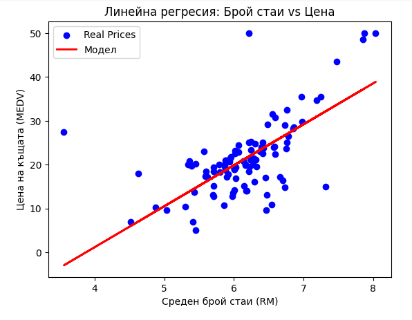

# Boston Housing Prices - Simple Linear Regression in Google Colab

This project demonstrates a simple machine learning workflow using Google Colab, where we predict Boston housing prices based on the average number of rooms per dwelling (RM feature).

## 📊 Project Overview

- **Dataset**: Boston Housing Dataset (`boston.csv`)
- **Goal**: Predict median house prices (`MEDV`) using a simple linear regression model with `RM` (average number of rooms) as the only feature.
- **Libraries Used**: `pandas`, `numpy`, `scikit-learn`, `matplotlib`, `seaborn`

## 🔬 Main Steps

1. **Load Data**
   - Upload and read `boston.csv` using `pandas`.

2. **Explore Data**
   - View basic stats and visualize relationships.

3. **Prepare Data**
   - Use `RM` as input (`X`) and `MEDV` as output (`y`).

4. **Split Data**
   - Train/test split with `train_test_split`.

5. **Train Model**
   - Train a linear regression model using `scikit-learn`.

6. **Evaluate Model**
   - Calculate Mean Squared Error (MSE) and R² score.
   - Visualize real vs. predicted prices.

## 📈 Results

- **Mean Squared Error**: ~46.14
- **R² Score**: ~0.37  
  (Shows the model’s performance; this simple model can be improved with more features.)

  

## 📎 How to Run

1. Open the `notebook.ipynb` file in Google Colab.
2. Upload `boston.csv` when prompted.
3. Run all cells to reproduce the results.

## 🛠️ Requirements

```bash
pip install pandas numpy scikit-learn matplotlib seaborn
```

## ✨ Future Improvements

 - Use multiple features instead of only RM for better accuracy.

 - Try other regression algorithms.

 - Add cross-validation.

 - Tune hyperparameters.
